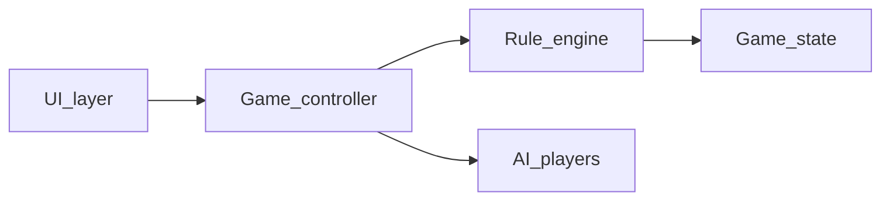

# AI Implementation Plan — Product rules and architecture (Cinco UNO)

## Summary

Lock the playable UNO subset, player model (one human + N AI with N user-selectable), high-level module boundaries, and repository layout for a vanilla HTML/CSS/JavaScript implementation. This document is the contract for later UI, engine, AI, and QA plans.

## Objective

Produce an unambiguous foundation so implementers can build the game without revisiting core rules or folder structure mid-project.

## Scope

### In scope

- Card inventory and ranks used in the digital game.
- House rules for draw, wild color choice, special cards, and reshuffle when the draw pile is empty.
- Player counts: exactly one human; N computer opponents where N is chosen before play (recommended range **1–5**, justified below).
- High-level architecture: UI, controller, rule engine, AI, and persistent game state model.
- Suggested file and module names under a dedicated static app folder.
- Planning-only validation tests for requirements and state transitions (no executable code in this phase).

### Out of scope

- Implementation of HTML, CSS, or JavaScript (covered in plans 02–05).
- Network multiplayer, accounts, or persistence across browser sessions.
- Audio, animations beyond simple CSS transitions, or mobile native wrappers.
- Full legal compliance with Mattel branding; use generic “UNO-like” naming in user-facing copy if required by policy.

## Affected areas (planned)

New static mini-app (paths are proposals; adjust only if repo conventions require):

- `uno-game/index.html` — shell and semantic regions.
- `uno-game/styles.css` — presentation.
- `uno-game/js/state.js` — serializable game state types and initial factories (optional split).
- `uno-game/js/engine.js` — pure rule transitions (no DOM).
- `uno-game/js/ai.js` — computer move selection.
- `uno-game/js/ui.js` — DOM binding and rendering.
- `uno-game/js/main.js` — bootstrap, menu → game wiring.

Single-file alternative (`uno-game/app.js` only) is allowed if the team prefers; if so, still keep conceptual layers matching the diagram below.

## Rules baseline (normative for engine plan)

**Deck**: 108 cards as in standard UNO: four colors (red, yellow, green, blue); numbers 0–9 (one 0, two of 1–9 per color); two Skip, Reverse, and Draw Two per color; four Wild and four Wild Draw Four.

**Deal**: 7 cards per player; remainder is draw pile. Flip one card from draw pile to start discard; if starter is Wild or Wild Draw Four, reshuffle starter into draw pile and flip again until starter is a colored card (document this explicitly in engine plan).

**Turn order**: Start clockwise. Reverse flips direction. Skip skips one seat. After Skip/Reverse/Draw Two resolution, advance current player per direction.

**Legal play**: A card may be played if it matches top discard on color, number, or symbol (for action cards). Wild and Wild Draw Four may be played anytime subject to Wild Draw Four restriction below.

**Wild Draw Four**: Only legal if the player has no other card that matches current **color** (number/symbol on discard irrelevant for this check). If challenged (optional), implementer may omit challenge rule for v1; document “no challenge” in Open Questions if omitted.

**Wild**: Player chooses the next color after play.

**Draw Two**: Next player draws two and loses their turn (unless stacking is enabled; default **no stacking** for v1 to reduce ambiguity).

**Going out**: When a player plays their second-to-last card, they must have declared “UNO”. For solo + AI, support one of: (A) automatic UNO when one card remains, or (B) button + penalty if not pressed before playing last card. **Recommendation for v1**: (A) automatic UNO to avoid frustration with AI; optional (B) as stretch in plan 05.

**Win**: First player to empty hand wins the round; optional match scoring can be “first to N round wins” — default **single round per game** for v1 unless product asks otherwise.

**Empty draw pile**: Reshuffle all cards from discard except the top card into a new draw pile; if still impossible (edge: almost never in UNO), game may be stuck — engine plan must define recovery (e.g. shuffle entire discard except top).

**AI count**: UI offers integer N ∈ [1, 5]. **Rationale**: Five AIs plus human yields six hands; still readable on desktop layouts from plan 02. Values above five increase clutter and turn latency; range is configurable constant `MAX_AI_OPPONENTS`.

## Architecture

- **Game_state**: Immutable or copy-on-write snapshot: hands (hidden from UI for non-human seats except count), draw pile, discard pile, current player index, direction, selected wild color if pending, phase (`menu`, `playing`, `roundOver`, `gameOver`).
- **Rule_engine**: Given state + intent (play card id, draw, choose wild color), returns result `{ ok, newState, events }` or validation errors. No DOM.
- **Game_controller**: Owns loop: apply engine for human; for AI seats, query AI then apply engine. Emits events for UI.
- **AI_players**: Uses engine’s “legal moves” helper only (same surface as human).
- **UI_layer**: Renders state; sends intents to controller.

## Implementation plan

1. Create `uno-game/` directory and stub files listed in Affected areas (empty or comment-only), or document single-file mapping if using one bundle.
2. Add `MAX_AI_OPPONENTS = 5` and `MIN_AI_OPPONENTS = 1` as documented constants (implementation in plan 03/04).
3. Write a one-page `RULES.md` inside `uno-game/` optional developer note mirroring the Rules baseline (optional; skip if product forbids extra docs).
4. Define the state machine phases and allowed transitions:

   - `menu` → `playing` (after user selects N and starts).
   - `playing` → `roundOver` (when any hand length becomes 0).
   - `roundOver` → `menu` or `gameOver` (v1: `menu` with “Play again” is enough).
   - `playing` → `gameOver` only if match-based scoring added later.

5. Agree on event vocabulary strings for UI (`TURN_CHANGED`, `CARD_PLAYED`, `DRAWN`, `ROUND_WON`, etc.) in engine or controller; document list in plan 03.
6. Review Open Questions with stakeholders before coding engine.

## Risks / edge cases

- **Wild Draw Four legality** is easy to get wrong; incorrect rules frustrate players who know UNO.
- **Starter card** special cases (Wild first) must be specified to avoid infinite loops in deal.
- **Information leakage**: UI must not expose AI hole cards; only counts and public piles.
- **Reshuffle** with very small discard can leave draw pile empty again; engine must loop until playable or declare terminal error.

## Validation / testing

Use manual checklist during design review (no code yet).

| ID | Preconditions | Steps | Expected result |
|----|---------------|-------|-----------------|
| T1.1 | Rules doc read | List all card types and counts | Totals match 108-card standard inventory |
| T1.2 | N/A | Trace one full turn: legal match, illegal match, draw | Written trace matches Rules baseline |
| T1.3 | State machine draft | From `menu`, list every valid next phase | Only documented transitions exist |
| T1.4 | N/A | Choose N=1 and N=5 | Both in range; N=0 and N=6 rejected by spec |
| T1.5 | Architecture diagram | For each arrow, name one responsibility | No circular dependency (Engine does not import UI) |
| T1.6 | Wild Draw Four rule | Player holds only Wild Draw Four vs colored top | Play allowed; player holds colored match | Play Wild Draw Four disallowed if “no other playable by color” rule enforced |
| T1.7 | Starter edge | Top discard would be Wild | Spec says reshuffle/retry until colored starter |
| T1.8 | Privacy | UI responsibilities listed | Human sees own cards; AI hands as count only |

**Cross-plan regression (after later phases)**:

- Re-run T1.5 after any refactor that introduces imports between layers.
- Re-run T1.6 after engine changes to Wild Draw Four.

## Open questions

1. **UNO call**: Confirm automatic UNO (recommended) vs button + penalty for v1.
2. **Match scoring**: Single round only, or first-to-3 wins?
3. **Stacking**: Confirm explicitly **off** for v1 unless product requires it.
4. **Branding**: Confirm user-visible name (“Cinco UNO” vs generic “Color discard game”).
